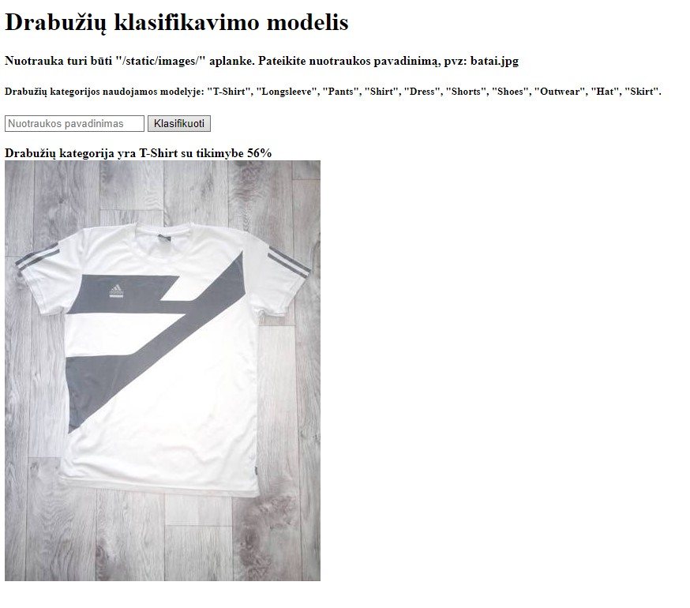

# Drabužių klasifikavimas
Drabužių duomenys paimti iš - https://github.com/alexeygrigorev/clothing-dataset
## Duomenys
Duomenų failas `images.csv` :
- `image` - nuotraukos pavadinimas
- `sender_id` - nuotraukos siuntėjo ID (Šis parametras mūsų užduočiai nereikalingas)
- `label` - drabužio kategorija
- `kids` - nurodo ar drabužis yra vaikiškas

## Modelio pasirinkimas su galutinėmis metrikomis
Pasirinktas jau ištreniruotas modelis mobilenet V2, nes savarankiškai kurtų modelių geriausias gautas tikslumas yra 47%. 
Šis modelis apmokytas naudojant didžiulę nuotraukų duomenų bazę, kurioje yra įvairių kategorijų nuotraukų.

Modelio parametrai :
-    `Batch size` = 16
-    `Learning rate` = 0.001
-    `Regularizer parametrai`: L1=0, L2=0
-    `Dropout_prob` = 0.1
-    `Paslėptas sluoksnis` - 32 vertės

## API serverio paleidimas
Paleidžiamas app.py failas esantis flash_app direktorijoje. Paleistame tinklalapyje aprašyta kur turi būti išsaugota 
nuotrauka, kokiu formatu turi būti pateiktas nuotraukos pavadinimas ir modelyje apmokytos kategorijos.
Pateikus nuotraukos pavadinimą, nuotrauka atvaizduojama su modelio nustatyta kategorija tinklalapyje.

Lentelėje žemiau pateikti apmokytų kategorijų pavyzdžiai iš pradinių duomenų ir interneto:

| Drabužių kategorija | Pradiniai duomenys | Duomenys iš interneto |
| :---------: | :---------------: | :---------: |
| T-Shirt | 29cffc8e-5e72-4b73-bbc0-20b9f1251bc2.jpg 0d1df3d4-ad7f-43f8-9673-90d368f6c853.jpg | 5f52d15d522439a88c5bc30dee8300eb.jpg Tshirt_noun_001_18267_2.jpg |
| Longsleeve | acf7a391-8450-453d-898b-2a4a9d2886f6.jpg cb8b684e-d24a-46b2-9fd8-430254d88412.jpg | fcec03edd6cacd1b2b75bedb3064b8ac.jpg longsleeve001.jpg |
| Pants | 046d0a65-f5a6-47f6-afaf-e692bfcfcb00.jpg 2884d941-ccc9-4eac-b7d7-b9996126a9c8.jpg | 633006eb36106010b70c21cddc5aa8a9.jpg 78a39f2609e244986276fc83fa11652b.jpg|
| Shirt | 575fc7c5-aa65-46c6-a343-35113c150129.jpg 36ad54ae-3450-4264-9655-4de51e6a1a32.jpg | 2e4147c28c008ad1f1c581c1c503f7fb.jpg Shirt_001.jpg |
| Dress | 56757a77-ee9a-42b3-a1fd-7f13f2cf752d.jpg 364e3f68-6505-4821-94af-d8381cd8b2d0.jpg | dress_001.jpg e6fc031512d373a9382626e1afb0ca6a.jpg|
| Shorts | 5379356a-40ee-4890-b416-2336a7d84061.jpg dfd4079d-967b-4b3e-8574-fbac11b58103.jpg | 869a2844b831c21d62f37498cf6c21d3.jpg 4b6f681b4190ebe3fd6a5c2df84ab0f9.jpg |
| Shoes | 65507fb8-3456-4c15-b53e-d1b03bf71a59.jpg 3855ea22-5e7f-411f-b1fa-6db27a676c06.jpg | 3e2c6ac3fc0cdd484c66cb5b966fabe6.jpg 3e2c6ac3fc0cdd484c66cb5b966fabe6.jpg |
| Outwear | b3863deb-1939-4406-97a3-f753914bab33.jpg 4b319ef4-36eb-431f-8627-dba90b8b3bed.jpg | 3eb23eac5915383c6be1ed47c6fcf2fc.jpg 97d76f88ecbb0d068ccd91804be9ad9a.jpg |
| Hat | 7b5181d5-253f-4936-9207-60e3368bf9e1.jpg 3f0be386-9a59-4aeb-93f6-dbe63e3a3002.jpg | 34fe48a97c023f640f55036dce56c934.jpg 4cd82f8690a2e9b497ae0f12061459a1.jpg |
| Skirt | 32b99302-cec7-4dec-adfa-3d4029674209.jpg f4b934fc-e326-4f72-b535-53288b8b82d3.jpg | istockphoto-882157056-612x612.jpg 0a782430f035774cf6179dcc952d3d15.jpg |

API svetainės vaizdas:

## Išvados
Sukurtų tiesinių modelių tikslumas nedidelis - 44%, optimizavus pavyko gauti šiek tiek geresnį tikslumą - 47%.
Sunku pasiekti didesnį šių modelių tikslumą dėl nedidelio duomenų kiekio ir ribotų kompiuterio pajėgumų, todėl
buvo nuspręsta panaudoti jau apmokytą modelį. Pasirinktas mobilenet V2 modelis, kuris apmokytas su didžiuliu duomenų
kiekiu (milijonai nuotraukų) iš šimtų skirtingų kategorijų. Modelį apmokius su mūsų turimais duomenimis gautas 84%-86%
tikslumas. Turint daugiau duomenų manau modelis galėtų būti dar tikslesnis (virš 90% tikslumas).
